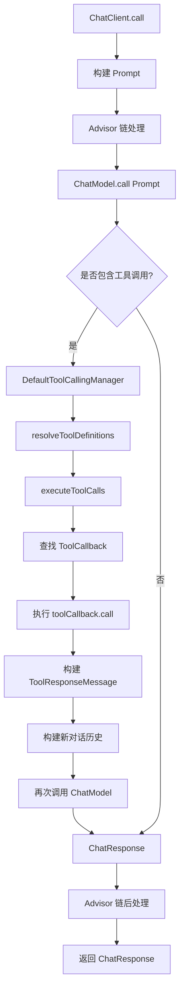
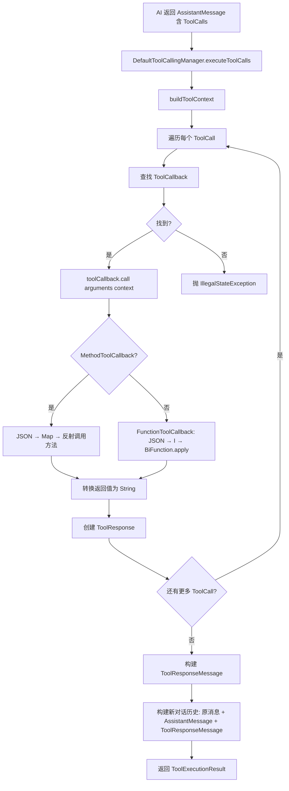
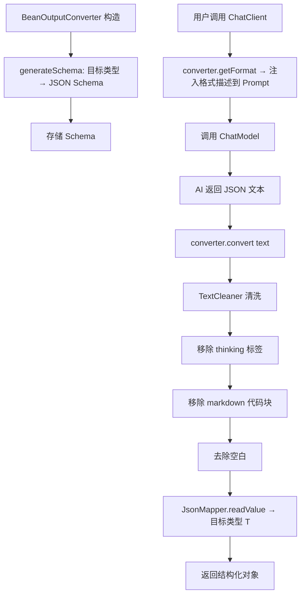
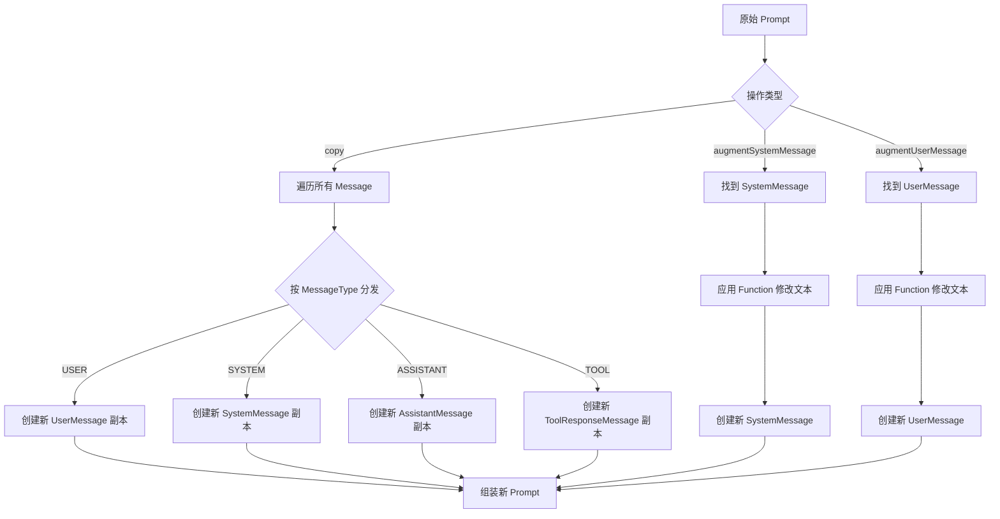

# spring-ai-model 长期记忆

## 模块概述

spring-ai-model 是 Spring AI 框架的核心抽象层，定义了所有 AI 模型交互的基础接口和数据类型。纯 Java 模块，无 Spring Boot 依赖。

**核心价值**：通过泛型接口抽象不同类型的 AI 模型（Chat、Embedding、Image、Transcription、TTS），提供统一的调用方式和数据结构。

## 模块结构

```
spring-ai-model/
├── src/main/java/org/springframework/ai/
│   ├── model/                    # 根抽象层
│   │   ├── Model.java            # 根接口：call(TReq) → TRes
│   │   ├── StreamingModel.java   # 流式接口：Flux<TRes> stream(TReq)
│   │   ├── ModelRequest.java     # 请求抽象：getInstructions() + getOptions()
│   │   ├── ModelResponse.java    # 响应抽象：getResult() + getResults() + getMetadata()
│   │   ├── ModelResult.java      # 单个结果：getOutput() + getMetadata()
│   │   ├── ModelOptions.java     # 选项标记接口
│   │   ├── ResponseMetadata.java # 响应元数据接口
│   │   ├── ResultMetadata.java   # 结果元数据接口
│   │   ├── ApiKey.java           # API 密钥抽象
│   │   ├── SimpleApiKey.java     # 简单 API 密钥实现
│   │   ├── ModelDescription.java # 模型描述接口
│   │   ├── ChatModelDescription.java / EmbeddingModelDescription.java
│   │   ├── KotlinModule.java     # Kotlin 支持
│   │   ├── ModelOptionsUtils.java # 工具类
│   │   ├── observation/          # 可观测性
│   │   ├── tool/                 # 工具调用管理
│   │   └── transformer/          # 元数据增强器
│   ├── chat/                     # Chat 模型层
│   │   ├── model/                # 核心接口和数据类
│   │   ├── messages/             # 消息类型
│   │   ├── prompt/               # Prompt 和 Options
│   │   ├── memory/               # 聊天记忆
│   │   ├── metadata/             # 元数据类型
│   │   └── observation/          # Chat 可观测性
│   ├── embedding/                # Embedding 模型层
│   ├── audio/                    # 音频模型层
│   │   ├── transcription/        # 语音转文字
│   │   └── tts/                  # 文字转语音
│   ├── image/                    # 图像模型层
│   ├── moderation/               # 内容审核模型层
│   ├── tool/                     # 工具（Function Calling）层
│   ├── converter/                # 结构化输出转换
│   ├── aot/                      # AOT 运行时提示
│   └── util/                     # 工具类
└── src/test/                     # 测试
```

## 核心接口族详解

### 1. Model 根接口族（model/ 包）

#### Model<TReq, TRes> — 根接口

```java
public interface Model<TReq extends ModelRequest<?>, TRes extends ModelResponse<?>> {
    TRes call(TReq request);
}
```

**设计要点**：
- 泛型参数约束：请求必须是 `ModelRequest<?>`，响应必须是 `ModelResponse<?>`
- 单一方法：`call(TReq)` — 同步调用
- 所有 AI 模型类型的根接口

#### StreamingModel<TReq, TResChunk> — 流式接口

```java
public interface StreamingModel<TReq extends ModelRequest<?>, TResChunk extends ModelResponse<?>> {
    Flux<TResChunk> stream(TReq request);
}
```

**设计要点**：
- 返回 `Flux<TResChunk>`（Project Reactor 流）
- 与 Model 接口分离，可选实现
- ChatModel 同时实现 Model + StreamingModel

#### ModelRequest<T> — 请求抽象

```java
public interface ModelRequest<T> {
    T getInstructions();           // 必需：指令/输入
    @Nullable ModelOptions getOptions();  // 可选：模型配置
}
```

#### ModelResponse<T> — 响应抽象

```java
public interface ModelResponse<T extends ModelResult<?>> {
    @Nullable T getResult();       // 第一个结果
    List<T> getResults();          // 所有结果
    ResponseMetadata getMetadata(); // 响应元数据
}
```

#### ModelResult<T> — 单个结果

```java
public interface ModelResult<T> {
    T getOutput();                 // 输出内容
    ResultMetadata getMetadata();  // 结果元数据
}
```

---

### 2. Chat 模型层（chat/ 包）

#### ChatModel — 核心接口

```java
public interface ChatModel extends Model<Prompt, ChatResponse>, StreamingChatModel {
    // 默认方法
    default String call(String message)           // 简单调用
    default ChatResponse call(Message... messages) // 多消息调用
    default ChatOptions getDefaultOptions()        // 默认选项
}
```

**继承链**：`ChatModel extends Model<Prompt, ChatResponse> + StreamingChatModel`

**关键方法**：
- `call(Prompt)` — 核心方法，返回 ChatResponse
- `call(String)` — 便捷方法，包装为 UserMessage
- `call(Message...)` — 便捷方法，包装为 Prompt
- `stream(Prompt)` — 流式调用（默认抛 UnsupportedOperationException）

#### Prompt — 请求封装

```java
public class Prompt implements ModelRequest<List<Message>> {
    // 核心方法
    List<Message> getContents()                    // 获取所有消息
    List<Message> getInstructions()                // 同 getContents()
    String getInstructionsAsString()               // 拼接所有消息文本
    Optional<SystemMessage> getSystemMessage()     // 获取系统消息
    Optional<UserMessage> getUserMessage()         // 获取用户消息
    Optional<Message> getLastUserOrToolResponseMessage()  // 最后一个用户/工具消息
    List<SystemMessage> getSystemMessages()        // 获取所有系统消息
    List<UserMessage> getUserMessages()            // 获取所有用户消息

    // 不可变操作
    Prompt copy()                                  // 深拷贝（按 MessageType 分发创建）
    Prompt augmentSystemMessage(Function<String, String>)  // 增强系统消息
    Prompt augmentUserMessage(Function<String, String>)    // 增强用户消息
    Builder mutate()                               // 返回 Builder 用于修改
}
```

**设计要点**：
- 不可变设计：所有修改操作返回新实例
- `copy()` 方法按 MessageType 分发创建不同类型的消息副本
- 支持 ChatOptions（通过 `getOptions()` 获取）

#### ChatResponse — 响应封装

```java
public class ChatResponse implements ModelResponse<Generation> {
    // 核心方法
    List<Generation> getResults()                  // 获取所有生成结果
    Generation getResult()                         // 获取第一个结果（便捷方法）
    boolean hasToolCalls()                         // 是否包含工具调用
    boolean hasFinishReasons(Set<String> reasons)  // 检查结束原因
    ChatResponseMetadata getMetadata()             // 响应元数据
}
```

**关键判断**：
- `hasToolCalls()`：遍历所有 Generation，检查 AssistantMessage 是否包含 ToolCall
- `hasFinishReasons(Set<String>)：检查是否有 Generation 的结束原因在指定集合中

#### Generation — 单个生成结果

```java
public class Generation implements ModelResult<AssistantMessage> {
    AssistantMessage getOutput()                   // AssistantMessage（含文本和 toolCalls）
    ChatGenerationMetadata getMetadata()           // 生成元数据（finishReason 等）
}
```

#### Message 接口族

```
Content (spring-ai-commons)
  └── Message (extends Content)
        ├── getText()
        ├── getMetadata()
        ├── getData()       // 多模态数据
        └── getMessageType() → MessageType enum
              │
              ├── UserMessage
              │     ├── String text
              │     ├── Map<String, Object> metadata
              │     └── List<Media> media
              │
              ├── SystemMessage
              │     ├── String text
              │     └── Map<String, Object> metadata
              │
              ├── AssistantMessage
              │     ├── String text
              │     ├── Map<String, Object> metadata
              │     ├── List<ToolCall> toolCalls    ← 关键：工具调用
              │     └── List<Media> media
              │
              └── ToolResponseMessage
                    ├── List<ToolResponse> responses  ← 工具返回结果
                    │     ├── String id
                    │     ├── String name
                    │     └── String responseData
                    └── Map<String, Object> metadata
```

#### MessageType 枚举

```java
public enum MessageType {
    USER, SYSTEM, ASSISTANT, TOOL
}
```

#### ChatOptions — 模型配置

```java
public interface ChatOptions extends ModelOptions {
    String getModel();
    Float getFrequencyPenalty();
    Integer getMaxTokens();
    Float getPresencePenalty();
    List<String> getStopSequences();
    Float getTemperature();
    Integer getTopK();
    Float getTopP();

    ChatOptions copy();
    Builder<?, ?> mutate();

    // Builder 接口
    interface Builder<T extends ChatOptions, B extends Builder<T, B>> {
        B model(String model);
        B frequencyPenalty(Float frequencyPenalty);
        B maxTokens(Integer maxTokens);
        B presencePenalty(Float presencePenalty);
        B stopSequences(List<String> stopSequences);
        B temperature(Float temperature);
        B topK(Integer topK);
        B topP(Float topP);
        T build();
        B from(T options);
        B combineWith(ChatOptions.Builder<?> otherBuilder);
    }
}
```

#### ChatMemory — 聊天记忆

```java
public interface ChatMemory {
    void add(String conversationId, List<Message> messages);
    List<Message> get(String conversationId);
    void clear(String conversationId);
}
```

**实现**：`MessageWindowChatMemory`
- 滑动窗口，默认 20 条消息
- SystemMessage 特殊处理：新的 SystemMessage 会替换旧的
- 超过窗口大小时，优先保留 SystemMessage，淘汰其他消息
- 依赖 `ChatMemoryRepository` 存储

**ChatMemoryRepository**：
```java
public interface ChatMemoryRepository {
    List<Message> findByConversationId(String conversationId);
    void saveAll(String conversationId, List<Message> messages);
    void deleteByConversationId(String conversationId);
}
```

**默认实现**：`InMemoryChatMemoryRepository`（内存存储）

---

### 3. Embedding 模型层（embedding/ 包）

#### EmbeddingModel — 文本向量化接口

```java
public interface EmbeddingModel extends Model<EmbeddingRequest, EmbeddingResponse> {
    // 基础方法
    float[] embed(String text)                           // 单文本向量化
    float[] embed(Document document)                     // 文档向量化
    List<float[]> embed(List<String> texts)              // 批量向量化
    EmbeddingResponse embedForResponse(List<String> texts)  // 返回完整响应

    // 分批处理
    List<float[]> embed(List<Document> docs, EmbeddingOptions opts, BatchingStrategy strategy)

    // 向量维度
    int dimensions()                                     // 默认调用 embed("Test String").length

    // 内容提取
    @Nullable String getEmbeddingContent(Document document)  // 默认返回 document.getText()
}
```

**关键设计**：
- `dimensions()` 默认实现会调用远程 API（通过 `embed("Test String")`），Provider 应覆盖
- `getEmbeddingContent()` 支持 Provider 覆盖以使用 MetadataMode
- `BatchingStrategy` 控制批量大小，避免超出 API 限制

#### 数据类

```java
record EmbeddingRequest(List<String> instructions, @Nullable EmbeddingOptions options) implements ModelRequest<List<String>> {}
record EmbeddingResponse(List<Embedding> results, @Nullable EmbeddingResponseMetadata metadata) implements ModelResponse<Embedding> {}
record Embedding(float[] output, Integer index, @Nullable EmbeddingMetadata metadata) implements ModelResult<float[]> {}
```

---

### 4. Audio 模型层（audio/ 包）

#### TranscriptionModel — 语音转文字

```java
public interface TranscriptionModel extends Model<AudioTranscriptionPrompt, AudioTranscriptionResponse> {
    // 标准 Model.call() 方法
}
```

**数据类**：
- `AudioTranscriptionPrompt` — 包含 `AudioAudio`（音频数据）+ `AudioTranscriptionOptions`
- `AudioTranscriptionResponse` — 包含 `AudioTranscription`（文本结果）+ `AudioTranscriptionMetadata`
- `AudioTranscription` — 实现 `Content` 接口，包含转录文本

#### TextToSpeechModel — 文字转语音

```java
public interface TextToSpeechModel extends Model<TextToSpeechPrompt, TextToSpeechResponse> {
    default byte[] call(String text)    // 便捷方法
}
```

**数据类**：
- `TextToSpeechPrompt` — 包含 `TextToSpeechMessage` + `TextToSpeechOptions`
- `TextToSpeechResponse` — 包含 `Speech`（音频数据）
- `Speech` — 实现 `ModelResult<byte[]>`，包含音频字节数组

---

### 5. Image 模型层（image/ 包）

#### ImageModel — 图像生成接口

```java
public interface ImageModel extends Model<ImagePrompt, ImageResponse> {
    default ImageResponse call(String text)  // 便捷方法，包装为 ImagePrompt
}
```

---

### 6. Tool 调用层（tool/ 包）

#### ToolCallback — 工具回调核心接口

```java
public interface ToolCallback {
    ToolDefinition getToolDefinition();                          // 工具定义（名称、描述、Schema）
    default ToolMetadata getToolMetadata()                       // 工具元数据（returnDirect 等）
    String call(String toolInput);                               // 执行工具（无上下文）
    default String call(String toolInput, ToolContext toolContext) // 执行工具（带上下文）
}
```

#### ToolDefinition — 工具定义

```java
public interface ToolDefinition {
    String name();        // 工具名称（唯一）
    String description(); // 工具描述（AI 决定何时调用）
    String inputSchema(); // 参数 JSON Schema
}
```

#### @Tool 注解

```java
@Target({ElementType.METHOD, ElementType.ANNOTATION_TYPE})
@Retention(RetentionPolicy.RUNTIME)
public @interface Tool {
    String name() default "";                        // 工具名（默认方法名）
    String description() default "";                 // 描述（默认方法名）
    boolean returnDirect() default false;            // 结果直接返回用户
    Class<? extends ToolCallResultConverter> resultConverter() default DefaultToolCallResultConverter.class;
}
```

#### @ToolParam 注解

```java
@Target({ElementType.PARAMETER, ElementType.FIELD})
@Retention(RetentionPolicy.RUNTIME)
public @interface ToolParam {
    String name() default "";        // 参数名
    String description() default ""; // 参数描述
    boolean required() default true; // 是否必需
}
```

#### MethodToolCallback — 注解方法实现

**核心流程**：
```
1. validateToolContextSupport()  — 验证 ToolContext 是否可用
2. extractToolArguments()       — JSON 解析 toolInput → Map<String, Object>
3. buildMethodArguments()       — 映射到方法参数（处理 ToolContext 参数）
4. callMethod()                 — 反射调用方法（处理非 public 访问）
5. toolCallResultConverter.convert() — 转换返回值为字符串
```

**关键设计**：
- 支持静态方法和实例方法
- 自动处理 ToolContext 参数注入
- 非 public 类/方法自动 `setAccessible(true)`
- 异常包装为 `ToolExecutionException`

#### FunctionToolCallback<I, O> — Function 实现

**核心流程**：
```
1. JsonParser.fromJson() — JSON → I 类型输入
2. toolFunction.apply()  — 执行 BiFunction<I, ToolContext, O>
3. toolCallResultConverter.convert() — O → String
```

**Builder 工厂方法**：
```java
FunctionToolCallback.builder("name", (Function<I, O>) fn)           // Function
FunctionToolCallback.builder("name", (BiFunction<I, ToolContext, O>) fn)  // BiFunction
FunctionToolCallback.builder("name", (Supplier<O>) supplier)        // Supplier
FunctionToolCallback.builder("name", (Consumer<I>) consumer)        // Consumer
```

#### DefaultToolCallingManager — 工具调用管理器

**核心流程**：
```
1. resolveToolDefinitions() — 从 ToolCallingChatOptions 解析 ToolDefinition 列表
2. executeToolCalls()       — 执行所有工具调用
   a. buildToolContext()    — 构建 ToolContext（从 Prompt Options 提取）
   b. executeToolCall()     — 遍历 ToolCall，逐个执行
      - 查找 ToolCallback（先从 options，再从 resolver）
      - 执行 toolCallback.call()
      - 收集 ToolResponse
      - 处理 returnDirect 标记
   c. buildConversationHistoryAfterToolExecution() — 构建新对话历史
3. 返回 ToolExecutionResult（conversationHistory + returnDirect）
```

**关键设计**：
- 支持 ToolContext 注入（通过 ToolCallingChatOptions.getToolContext()）
- returnDirect 逻辑：所有工具都 returnDirect=true 时才直接返回
- 异常处理：通过 `ToolExecutionExceptionProcessor` 处理
- 可观测性：每个工具调用都有 Observation 包装

---

### 7. Structured Output 层（converter/ 包）

#### StructuredOutputConverter<T> — 结构化输出转换接口

```java
public interface StructuredOutputConverter<T> extends Converter<String, T>, FormatProvider {
    // 继承 Converter<String, T> — convert(String) → T
    // 继承 FormatProvider — getFormat() → 返回格式描述（注入 Prompt）
}
```

#### BeanOutputConverter<T> — JSON → Bean 转换

**核心流程**：
```
1. 构造函数：generateSchema() — 生成目标类型的 JSON Schema
2. getFormat() — 返回格式描述模板（含 JSON Schema，注入 Prompt）
3. convert(String text) — 清洗文本 → JSON 解析 → T 类型对象
```

**文本清洗链**（默认）：
```
WhitespaceCleaner → ThinkingTagCleaner → MarkdownCodeBlockCleaner → WhitespaceCleaner
```

- `ThinkingTagCleaner`：移除 `<thinking>...</thinking>` 标签（Amazon Nova、Qwen 等模型）
- `MarkdownCodeBlockCleaner`：移除 ` ```json ... ``` ` 代码块
- `WhitespaceCleaner`：首尾空白处理

**JSON Schema 生成**：
- 使用 `victools/jsonschema-generator` 库
- 支持 Jackson 注解（`@JsonProperty` required、order）
- 支持 Kotlin 数据类
- Schema 版本：Draft 2020-12
- 默认禁止额外属性（`FORBIDDEN_ADDITIONAL_PROPERTIES_BY_DEFAULT`）

#### 其他转换器

- `ListOutputConverter`：文本 → `List<String>`（按逗号/换行分割）
- `MapOutputConverter`：文本 → `Map<String, Object>`（JSON 解析）
- `AbstractConversionServiceOutputConverter`：使用 Spring ConversionService
- `AbstractMessageOutputConverter`：处理 Message 输出

---

### 8. AOT 层（aot/ 包）

- `AiRuntimeHints.java` — 注册 AOT 运行时提示
- `SpringAiCoreRuntimeHints.java` — 核心类反射/序列化提示
- `ToolBeanRegistrationAotProcessor.java` — @Tool Bean AOT 处理
- `ToolRuntimeHints.java` — 工具相关反射提示

---

### 9. Observability（observation/ 包）

**model/observation/**：
- `ModelObservationContext` — 模型观测上下文
- `ModelUsageMetricsGenerator` — 用量指标生成
- `ErrorLoggingObservationHandler` — 错误日志处理

**chat/observation/**：
- `ChatModelObservationContext` — Chat 模型观测上下文
- `DefaultChatModelObservationConvention` — 默认观测约定
- `ChatModelObservationDocumentation` — 观测文档（Key 定义）
- `ChatModelCompletionObservationHandler` — 完成事件处理
- `ChatModelMeterObservationHandler` — 指标处理
- `ChatModelPromptContentObservationHandler` — Prompt 内容处理

## 关键流程图

### 1. Chat 调用流程（同步 call）



### 2. Tool 调用执行流程



### 3. Structured Output 流程



### 4. Embedding 批量处理流程

```mermaid
flowchart TD
    A[EmbeddingModel.embed documents options batchingStrategy] --> B[batchingStrategy.batch documents]
    B --> C[遍历每个批次]
    C --> D[提取每个 Document 的文本内容]
    D --> E[构建 EmbeddingRequest]
    E --> F[调用 call EmbeddingRequest]
    F --> G[收集 Embedding 结果]
    G --> H{还有更多批次?}
    H -->|是| C
    H -->|否| I[验证结果数量 = 文档数量]
    I --> J[返回 float[] 列表]
```

### 5. Prompt 不可变操作流程



## 核心接口继承链

```
Model<TReq, TRes>
├── ChatModel (= Model<Prompt, ChatResponse> + StreamingChatModel)
├── EmbeddingModel (= Model<EmbeddingRequest, EmbeddingResponse>)
├── ImageModel (= Model<ImagePrompt, ImageResponse>)
├── TranscriptionModel (= Model<AudioTranscriptionPrompt, AudioTranscriptionResponse>)
└── TextToSpeechModel (= Model<TextToSpeechPrompt, TextToSpeechResponse>)

Content
├── MediaContent (adds getMedia())
├── Document (ETL 数据单元)
└── Message (聊天消息) + getMessageType() → MessageType
    ├── UserMessage
    ├── SystemMessage
    ├── AssistantMessage + getToolCalls()
    └── ToolResponseMessage + getResponses()

ModelRequest<T>
├── Prompt (T = List<Message>)
├── EmbeddingRequest (T = List<String>)
├── ImagePrompt
├── AudioTranscriptionPrompt
└── TextToSpeechPrompt

ModelResponse<T>
├── ChatResponse (T = Generation)
├── EmbeddingResponse (T = Embedding)
├── ImageResponse (T = ImageGeneration)
├── AudioTranscriptionResponse
└── TextToSpeechResponse

ToolCallback
├── MethodToolCallback (@Tool 注解方法)
└── FunctionToolCallback<I, O> (Function/BiFunction/Supplier/Consumer)

ChatMemory
└── MessageWindowChatMemory (滑动窗口实现)

StructuredOutputConverter<T> extends Converter<String, T> + FormatProvider
├── BeanOutputConverter<T> (JSON → Bean)
├── ListOutputConverter (JSON → List<String>)
└── MapOutputConverter (JSON → Map)
```

## 依赖关系

- `spring-ai-commons`：Content, Document, Media 基础数据结构
- Project Reactor：Flux/Mono（流式处理）
- Jackson（3.0 tools.jackson）：JSON 序列化
- victools/jsonschema-generator：JSON Schema 生成
- Micrometer：可观测性
- JSpecify：@Nullable/@NonNull 注解
- Spring Framework Core：ParameterizedTypeReference, Converter

## 设计模式总结

1. **泛型抽象**：`Model<TReq, TRes>` 统一不同 AI 模型的调用方式
2. **模板方法**：ChatModel 提供默认方法，Provider 只需实现核心 `call(Prompt)`
3. **Builder 模式**：Prompt, ChatOptions, ToolDefinition 等均使用 Builder
4. **不可变设计**：Prompt, ChatOptions 的修改操作返回新实例
5. **策略模式**：BatchingStrategy, TextCleaner, ToolCallResultConverter 可替换
6. **适配器模式**：MethodToolCallback 将 @Tool 方法适配为 ToolCallback 接口
7. **职责链模式**：DefaultToolCallingManager 管理工具调用的完整生命周期
