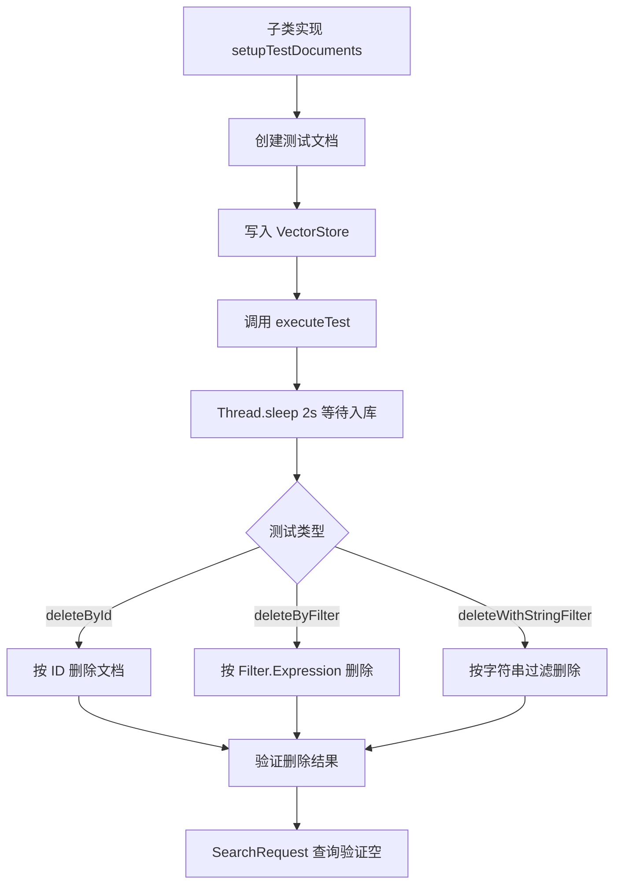
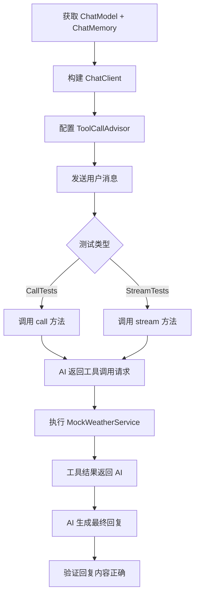

# spring-ai-test 长期记忆

## 模块概述

spring-ai-test 提供 Spring AI 集成测试的可复用基类和工具类。纯 Java 模块，无 Spring Boot 依赖。

**核心价值**：为 VectorStore、ChatOptions、ToolCallAdvisor 等组件提供标准化的集成测试模板，避免各 Provider 实现重复编写测试逻辑。

## 文件结构

```
spring-ai-test/
└── src/main/java/org/springframework/ai/test/
    ├── vectorstore/
    │   └── BaseVectorStoreTests.java          # VectorStore 集成测试基类
    ├── options/
    │   └── AbstractChatOptionsTests.java      # ChatOptions Builder 测试基类
    ├── chat/client/advisor/
    │   ├── AbstractToolCallAdvisorIT.java     # ToolCallAdvisor 集成测试基类
    │   └── MockWeatherService.java            # 模拟天气服务（Function<Request, Response>）
    ├── CurlyBracketEscaper.java               # 花括号转义工具
    └── utils/
        └── AudioPlayer.java                   # 音频播放工具
```

## 核心测试基类详解

### 1. BaseVectorStoreTests

**文件**：`vectorstore/BaseVectorStoreTests.java`

**设计模式**：模板方法模式

**核心 API**：
```java
// 模板方法 - 子类实现具体的测试逻辑
void executeTest(Consumer<VectorStore> testFunction)

// 测试数据创建
Document createDocument(String text, Map<String, Object> metadata, String media)
List<Document> setupTestDocuments(VectorStore vectorStore)  // abstract

// 三个内置测试方法
void deleteById(VectorStore vectorStore)                           // 按 ID 删除
void deleteWithStringFilterExpression(VectorStore vectorStore)     // 字符串过滤表达式删除
void deleteByFilter(VectorStore vectorStore)                       // Filter.Expression 删除
```

**测试流程**：
```
1. setupTestDocuments() → 创建测试文档
2. executeTest() → 执行具体测试逻辑（同步等待 2 秒让文档入库）
3. 验证删除操作（deleteById / deleteWithStringFilterExpression / deleteByFilter）
4. 验证文档已被删除（findByFilter 返回空列表）
```

**关键设计**：
- `setupTestDocuments()` 是 abstract 方法，子类必须实现，提供测试数据
- `executeTest()` 统一处理 2 秒等待（`Thread.sleep(2000)`），确保文档已入库
- 内置 3 种删除测试：by ID、by string filter、by Filter.Expression
- 删除后验证：使用 `vectorStore.similaritySearch(SearchRequest.builder().query("Great Depression").topK(50).build())` 检查

**使用示例**（PgVectorStoreIT）：
```java
class PgVectorStoreIT implements BaseVectorStoreTests {
    @Test
    void deleteById() {
        BaseVectorStoreTests.super.deleteById(vectorStore);
    }

    @Override
    public List<Document> setupTestDocuments(VectorStore vectorStore) {
        // 创建测试文档并写入
    }
}
```

---

### 2. AbstractChatOptionsTests

**文件**：`options/AbstractChatOptionsTests.java`

**设计模式**：模板方法模式

**核心 API**：
```java
// 子类必须实现的模板方法
ChatOptions.Builder<?, ?> readyToBuildBuilder()       // 返回已配置的 Builder
Class<?> getConcreteOptionsClass()                      // 返回具体 Options 类

// 两个内置测试方法
void builderShouldReturnNewInstances()   // 验证 Builder 返回新实例（不修改原对象）
void testMutateBehavior()                // 验证 mutate() 行为（修改后返回新实例）
```

**测试逻辑**：
- `builderShouldReturnNewInstances()`：
  1. 创建初始 Options
  2. 通过 Builder 修改 frequencyPenalty 和 temperature
  3. 验证原 Options 未变（不可变性）
  4. 验证新 Options 值正确

- `testMutateBehavior()`：
  1. 创建初始 Options
  2. 通过 mutate() 修改 temperature
  3. 验证原 Options 未变
  4. 验证新 Options temperature 已更新

---

### 3. AbstractToolCallAdvisorIT

**文件**：`chat/client/advisor/AbstractToolCallAdvisorIT.java`

**设计模式**：模板方法 + 内部测试类

**核心 API**：
```java
// 子类必须实现
ChatModel getChatModel()                    // 返回测试用的 ChatModel
ChatMemoryRepository getChatMemoryRepository()  // 返回 ChatMemory 存储

// 内部测试类
class CallTests    // 测试 call() 方法
class StreamTests  // 测试 stream() 方法
```

**测试场景**（CallTests 和 StreamTests 都包含）：
1. **多个工具调用**：验证 AI 能正确调用多个工具并返回结果
2. **外部记忆**：验证与 MessageChatMemoryAdvisor 的协同
3. **默认 Advisor 配置**：验证默认工具调用流程
4. **returnDirect**：验证 `@Tool(returnDirect=true)` 时结果直接返回，不经过模型

**关键测试数据**（MockWeatherService）：
```java
// 硬编码天气数据
巴黎: 15°C
东京: 10°C
旧金山: 30°C
```

---

### 4. MockWeatherService

**文件**：`chat/client/advisor/MockWeatherService.java`

**类型**：`Function<Request, Response>`

**用途**：提供可预测的天气数据，用于 ToolCallAdvisor 集成测试

**内部类**：
```java
record Request(String city)
record Response(String city, double temp, double humidity, double wind, String description)
```

**数据**：巴黎=15°C, 东京=10°C, 旧金山=30°C（湿度和风速固定）

---

### 5. CurlyBracketEscaper

**文件**：`CurlyBracketEscaper.java`

**功能**：花括号转义/反转义工具

**API**：
```java
static String escape(String input)    // { → \{, } → \}
static String unescape(String input)  // \{ → {, \} → }
```

**用途**：处理 PromptTemplate 中的花括号转义问题

---

### 6. AudioPlayer

**文件**：`utils/AudioPlayer.java`

**功能**：音频播放工具，使用 `javax.sound.sampled` API

**用途**：TTS（Text-to-Speech）集成测试中播放生成的音频

## 关键流程图

### VectorStore 集成测试流程



### ToolCallAdvisor 集成测试流程



## 依赖关系

- `spring-ai-core`：核心接口（VectorStore, ChatModel, Document, ChatOptions）
- `spring-ai-client-chat`：ChatClient API
- `spring-ai-rag`：RetrievalAugmentationAdvisor

## 使用模式

1. **VectorStore 测试**：实现 `BaseVectorStoreTests`，提供 `setupTestDocuments()`，调用内置测试方法
2. **ChatOptions 测试**：扩展 `AbstractChatOptionsTests`，提供 Builder 和 Options 类
3. **ToolCallAdvisor 测试**：扩展 `AbstractToolCallAdvisorIT`，提供 ChatModel 和 ChatMemoryRepository
